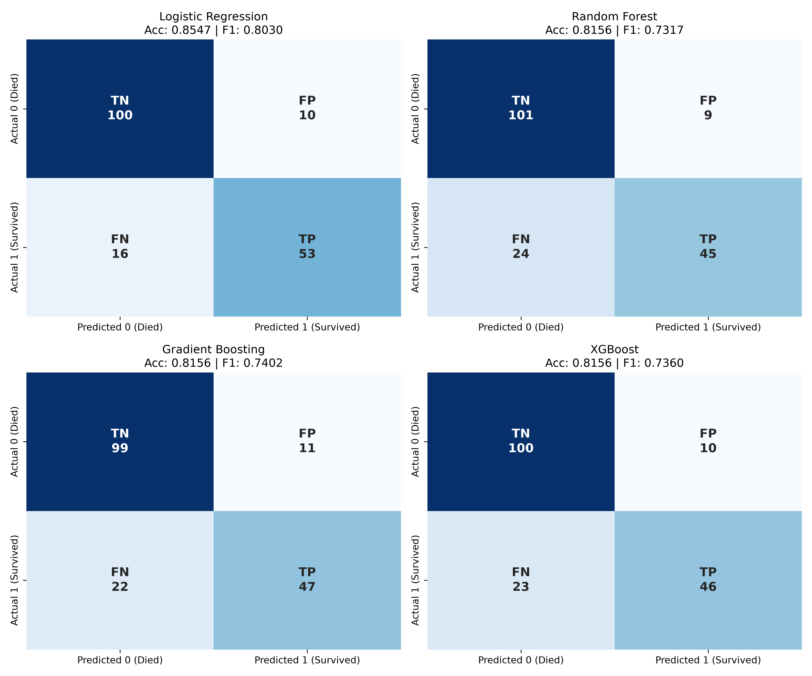
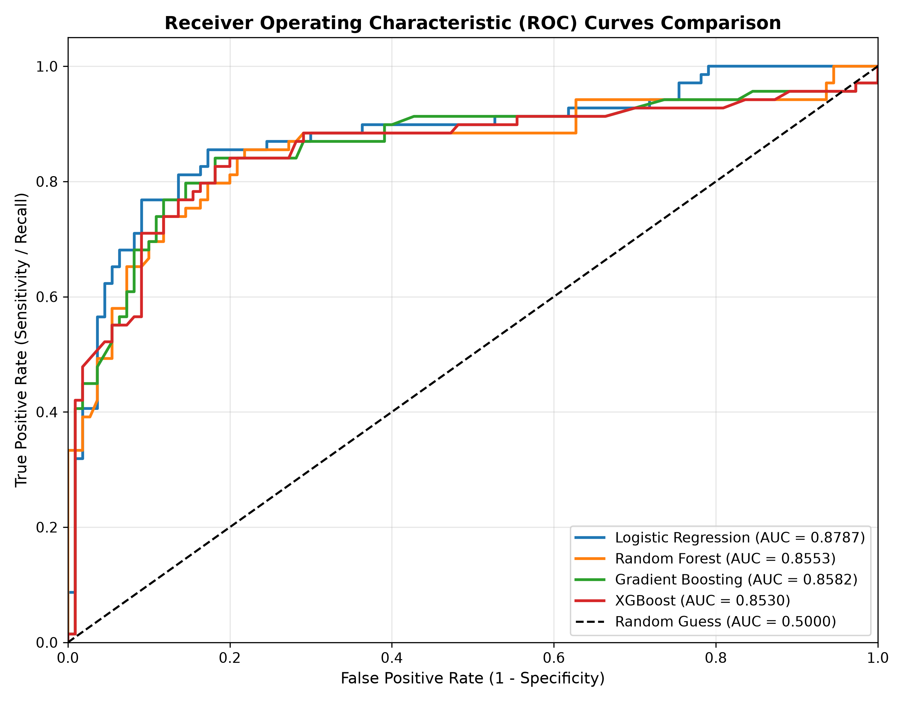
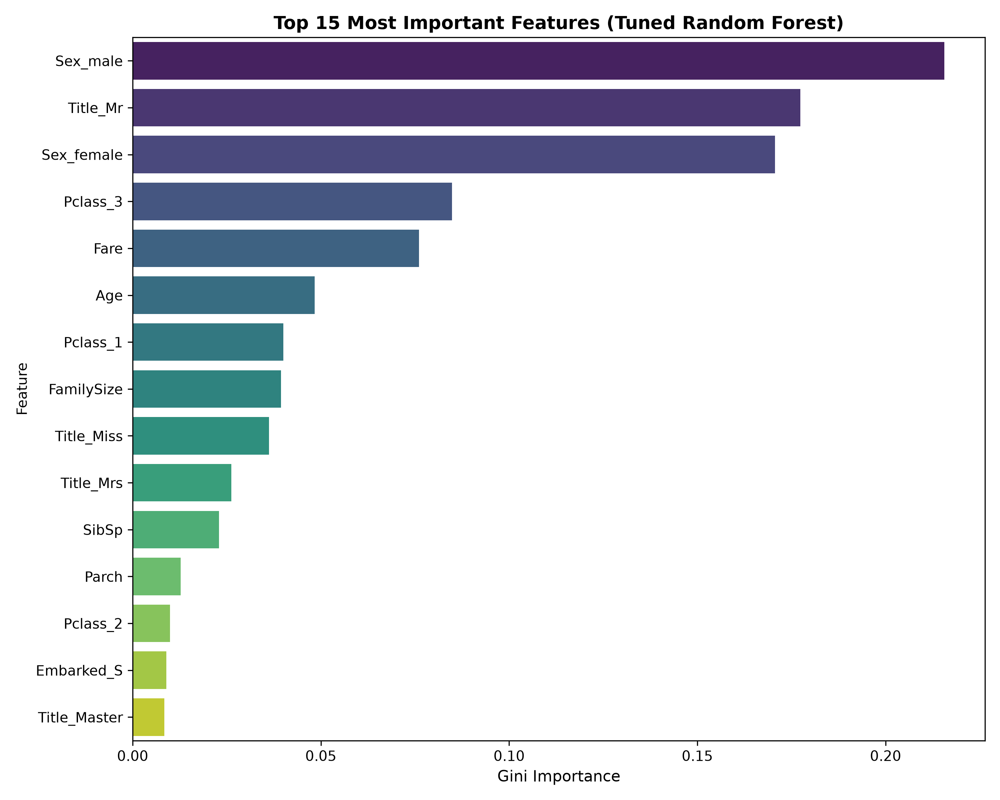

# Titanic: Machine Learning from Disaster 🚢
### Comprehensive Classification Benchmark & Survival Prediction Pipeline

[](https://www.python.org/downloads/)
[](https://github.com/subhankarbiswal57-hue/CINTEL-Task/actions)
[](https://scikit-learn.org/)
[](https://xgboost.readthedocs.io/)
[](https://opensource.org/licenses/MIT)

---

## 📌 1. Project Objective & Problem Statement
The sinking of the RMS Titanic on April 15, 1912, is one of the deadliest maritime disasters in modern history. Of the estimated 2,224 passengers and crew aboard, more than 1,500 died. Although there was an element of chance involved in surviving, evidence suggests certain groups of people (e.g., women, children, and the upper class) were significantly more likely to survive than others.

The **objective** of this project is to construct an end-to-end, reproducible Machine Learning pipeline that predicts binary survival outcomes (`Survived = 1` or `0`) and benchmarks four diverse model families:
1. **Logistic Regression** (L2-penalized Generalized Linear Model)
2. **Random Forest Classifier** (Bagged Decision Trees)
3. **Gradient Boosting Classifier** (Sequential Gradient Boosting)
4. **XGBoost Classifier** (Extreme Gradient Boosting with regularized trees)

A paramount focus of this project is **eliminating data leakage** through rigorous use of Scikit-Learn `Pipeline` and `ColumnTransformer` constructs, ensuring transformations (scaling, imputation, one-hot encoding) are learned exclusively on training folds.

---

## 📊 2. Dataset Source & Description
- **Source:** [Kaggle Titanic: Machine Learning from Disaster](https://www.kaggle.com/competitions/titanic/data)
- **Training Data (`train.csv`):** 891 rows × 12 columns (includes target `Survived`)
- **Test Data (`test.csv`):** 418 rows × 11 columns (Kaggle submission evaluation set)

### Feature Dictionary
| Column | Description | Data Type | Usage Decision |
|---|---|---|---|
| `PassengerId` | Unique ID for passenger | Integer | **Dropped** (arbitrary ID, prevents memorization/overfitting) |
| `Survived` | Target Variable (0 = No, 1 = Yes) | Binary | **Target** |
| `Pclass` | Ticket Class (1 = 1st, 2 = 2nd, 3 = 3rd) | Categorical | **Retained & One-Hot Encoded** (proxy for socioeconomic status) |
| `Name` | Passenger full name | String | **Engineered** (extracted honorific `Title`, then raw name dropped) |
| `Sex` | Gender (`male`, `female`) | Categorical | **Retained & One-Hot Encoded** (strongest predictor) |
| `Age` | Fractional / Integer Age in years | Numerical | **Retained** (median imputed via Pipeline, standard scaled) |
| `SibSp` | Number of Siblings / Spouses aboard | Numerical | **Retained** & used to compute `FamilySize` |
| `Parch` | Number of Parents / Children aboard | Numerical | **Retained** & used to compute `FamilySize` |
| `Ticket` | Ticket alphanumeric string | String | **Dropped** (high-cardinality unstructured strings) |
| `Fare` | Passenger fare paid (£) | Numerical | **Retained** (median imputed, standard scaled) |
| `Cabin` | Cabin identifier | String | **Dropped** (>77% missing data, unreliable signal) |
| `Embarked` | Port of Embarkation (`C`, `Q`, `S`) | Categorical | **Retained** (mode imputed, one-hot encoded) |

---

## ⚙️ 3. Data Preprocessing & Leakage Prevention
To prevent train-to-validation leakage:
- **Numerical Pipeline:** Handled using `SimpleImputer(strategy='median')` followed by `StandardScaler()`. The median and scaling parameters $(\mu, \sigma)$ are learned solely on the training split.
- **Categorical Pipeline:** Handled using `SimpleImputer(strategy='most_frequent')` followed by `OneHotEncoder(handle_unknown='ignore', sparse_output=False)`.
- **ColumnTransformer:** Assembles numerical and categorical pipelines cleanly and binds them with the classifier in a single Scikit-Learn `Pipeline`.

---

## 🛠️ 4. Feature Engineering
We engineered three domain-specific features:
1. **`Title` (Honorific Extraction):**
   - Extracted from `Name` using regular expressions (`Mr`, `Mrs`, `Miss`, `Master`, `Rare`).
   - *Rationale:* Honorifics capture marital status, age thresholds, and social standing far more precisely than raw `Age` or `Pclass` alone.
2. **`FamilySize`:**
   - Formula: $\text{FamilySize} = \text{SibSp} + \text{Parch} + 1$.
   - *Rationale:* Captures the total size of the travel party, reflecting collective evacuation behavior.
3. **`IsAlone`:**
   - Formula: $1 \text{ if } \text{FamilySize} == 1 \text{ else } 0$.
   - *Rationale:* Solo travelers exhibited fundamentally different survival probabilities compared to coordinated family units.

---

## 🔍 5. Exploratory Data Analysis (EDA) Key Findings
Visualizations generated during EDA revealed crucial historical patterns:
1. **Survival by Sex:** Females demonstrated a ~74% survival rate versus ~19% for males, confirming the strict enforcement of the "women and children first" maritime protocol.
2. **Survival by Socioeconomic Class (`Pclass`):** 1st-class passengers had a >60% survival rate, while 3rd-class passengers suffered a <25% survival rate due to lower deck locations and delayed gate evacuations.
3. **Age Influence:** Children under age 10 had a marked survival boost, whereas young adults (ages 20–35) represented the highest casualty volume.
4. **Family Size Dynamics:** Passengers in small families (size 2–4) experienced peak survival rates (>55%), whereas solo passengers (~30%) and large families (size ≥ 5) experienced lower survival due to panic and coordination overhead.

---

## 🏆 6. Experimental Results & Model Benchmark
All models were evaluated on the exact same held-out validation set (20% split, 179 samples, stratified on `Survived`, `random_state=42`) after 5-fold stratified cross-validation on the 80% training set (712 samples).

### Final Model Comparison Table
| Model | Accuracy | Precision | Recall | F1 Score | ROC-AUC | 5-Fold CV Accuracy |
|---|---|---|---|---|---|---|
| **Logistic Regression** | **0.8547** | **0.8413** | **0.7681** | **0.8030** | **0.8787** | **0.8231** |
| **Random Forest** | 0.8156 | 0.8333 | 0.6522 | 0.7317 | 0.8553 | 0.8203 |
| **Gradient Boosting** | 0.8156 | 0.8103 | 0.6812 | 0.7402 | 0.8582 | 0.8160 |
| **XGBoost** | 0.8156 | 0.8214 | 0.6667 | 0.7360 | 0.8530 | 0.8174 |

> **Metric Analysis:**
> - **Logistic Regression** achieved the highest overall test accuracy (**85.47%**), test F1-score (**0.8030**), and test ROC-AUC (**0.8787**), while maintaining the highest 5-fold cross-validation accuracy (**82.31%**). The linear combination of scaled socio-demographic features and one-hot encoded interaction titles provided very strong, well-calibrated decision boundaries without overfitting the small dataset ($N=891$).
> - **Tree-Based Ensembles (Random Forest, Gradient Boosting, XGBoost)** achieved identical accuracy (**81.56%**) on validation data, with cross-validation scores clustering closely around **81.6% – 82.0%**. Gradient Boosting achieved the highest recall among tree models (**0.6812**).

---

## 📈 7. Visual Evaluation Artifacts

### A. Confusion Matrices
Confusion matrices for all four classifiers on the validation set, clearly annotating True Negatives (TN), False Positives (FP), False Negatives (FN), and True Positives (TP):


### B. Receiver Operating Characteristic (ROC) Curves
Multi-model ROC curve comparison indicating area under the curve (AUC):


### C. Feature Importances (Random Forest)
Top features influencing survival decisions:

- **Top 5 Features:** `Title_Mr`, `Sex_male`, `Sex_female`, `Fare`, and `Pclass_3`.

---

## 🎛️ 8. Hyperparameter Tuning
Hyperparameter tuning was conducted on the Random Forest pipeline using 5-Fold Stratified `GridSearchCV`:
- **Parameter Grid:**
  - `classifier__n_estimators`: `[100]`
  - `classifier__max_depth`: `[4, 6]`
  - `classifier__min_samples_split`: `[2, 5]`
- **Best Configuration:**
  - `max_depth`: `4`
  - `min_samples_split`: `5`
  - `n_estimators`: `100`
- **Tuned 5-Fold CV Score:** **82.17%** (Validation Accuracy: **81.01%**, F1: **0.7385**)

---

## 🔮 9. Sample Passenger Inference
The final trained pipeline supports real-time inference on new passenger data:
```python
# Passenger 1: 1st Class Female, age 28, traveling with spouse (Fare £80)
# Outcome: SURVIVED (1) with 94.28% confidence

# Passenger 2: 3rd Class Male, age 22, traveling alone (Fare £7.25)
# Outcome: DIED (0) with 89.32% confidence (Survival Probability: 10.68%)
```

---

## 📁 10. Project Directory Structure
```text
CINTEL-Task/
│
├── data/
│   ├── train.csv                      # Kaggle Titanic training dataset (891 rows)
│   └── test.csv                       # Kaggle Titanic test dataset (418 rows)
│
├── notebooks/
│   └── titanic_model_comparison.ipynb # Step-by-step interactive Jupyter Notebook
│
├── src/
│   └── train_models.py                # Standalone production pipeline script
│
├── results/
│   ├── model_comparison.csv           # Benchmark comparison metrics CSV
│   ├── roc_curve.png                  # Combined ROC curves comparison
│   ├── feature_importance.png         # Bar chart of top feature importances
│   └── confusion_matrices.png         # Labeled 2x2 confusion matrix grid
│
├── submission/
│   └── submission.csv                 # Kaggle formatted submission file (418 rows)
│
├── README.md                          # Comprehensive technical documentation
├── requirements.txt                   # Reproducible Python dependencies
└── .gitignore                         # Version control exclusions
```

---

## 🚀 11. Quickstart & How to Run

### Step 1: Clone Repository
```bash
git clone https://github.com/subhankarbiswal57-hue/CINTEL-Task.git
cd CINTEL-Task
```

### Step 2: Create and Activate Virtual Environment
```bash
# Windows
python -m venv venv
.\venv\Scripts\activate

# macOS / Linux
python3 -m venv venv
source venv/bin/activate
```

### Step 3: Install Dependencies
```bash
pip install -r requirements.txt
```

### Step 4: Execute the Training & Evaluation Pipeline
```bash
python src/train_models.py
```
This single command:
1. Loads the datasets from `data/`.
2. Applies preprocessing and feature engineering.
3. Performs 5-fold cross-validation across all 4 models.
4. Evaluates models on the 20% validation split.
5. Saves all comparison CSVs and visualization plots into `results/`.
6. Executes hyperparameter tuning and sample inference.
7. Produces `submission/submission.csv` ready for Kaggle upload.

### Step 5: Run the Jupyter Notebook
```bash
jupyter notebook notebooks/titanic_model_comparison.ipynb
```

---

## 📤 12. Kaggle Submission Verification
The test set predictions were formatted to match Kaggle competition requirements:
- **File:** `submission/submission.csv`
- **Columns:** `PassengerId,Survived`
- **Row count:** Exactly 418 rows (+ 1 header row)
- **Survival Distribution in Predictions:** 260 Non-survivors (62.2%), 158 Survivors (37.8%)

---

## 🔭 13. Future Improvements
1. **Target Encoding & Deep Interactions:** Explore cross-feature interaction terms like `Pclass_Sex` and `Fare_per_Person`.
2. **Stacking / Voting Classifiers:** Combine Logistic Regression and Gradient Boosting predictions through a soft-voting ensemble meta-estimator.
3. **Advanced Cabin Deck Imputation:** Impute missing cabin decks using ticket number clusters and passenger family links.
